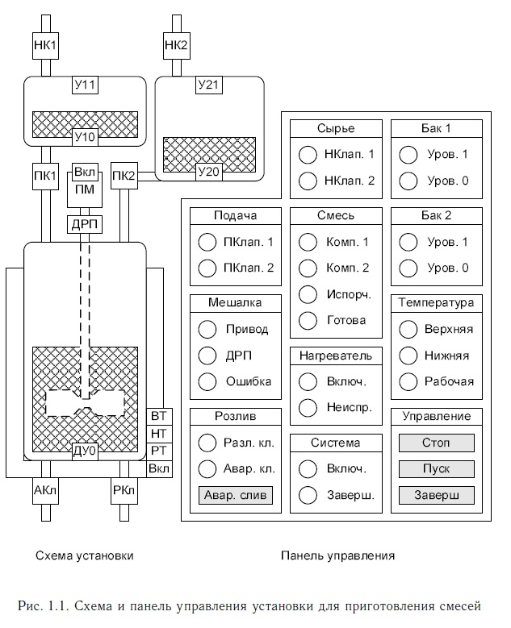
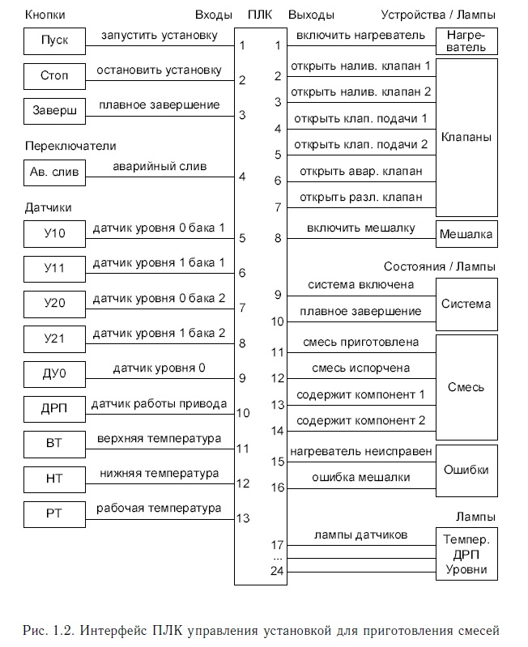
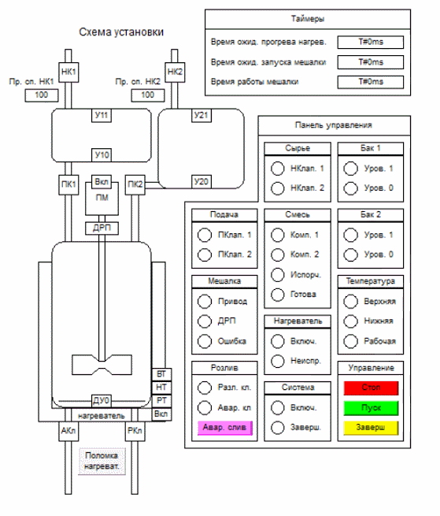
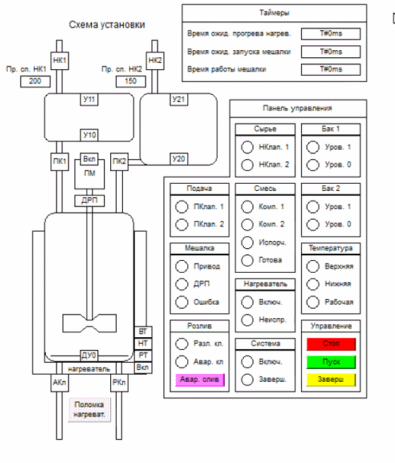

# УСТАНОВКА ДЛЯ ПРИГОТОВЛЕНИЯ СМЕСЕЙ II

Установка, схема которой представлена на рис. 1.1, предназначена
для приготовления смесей из двух компонентов. Сначала соответствующими компонентами через наливные клапаны «НК1» и «НК2»
заполняются мерные баки, а затем все содержимое баков подается
в резервуар для смешивания через клапаны подачи «ПК1» и «ПК2».
Далее в течение T секунд с помощью мешалки в резервуаре происходит
перемешивание компонентов при определенной температуре, которая
поддерживается нагревателем. По истечении этого времени открывается разливной клапан «РКл» и происходит выгрузка готовой смеси.
Выгрузка заканчивается, т. е. клапан «РКл» закрывается, как только
пропадает сигнал от датчика уровня «ДУ0». Аварийный клапан «АКл»
используется для принудительного слива смеси из резервуара. Объем
смешиваемых компонентов в баках (пустота и заполненность) определяется по соответствующим парам датчиков уровня «У10», «У11»
и «У20», «У21». Функционирование мешалки определяется по датчику
работы привода мешалки «ДРП». Температура нагревательного элемента отслеживается с помощью датчика верхней температуры «ВТ»,
датчика нижней температуры «НТ» и датчика рабочей температуры
«РТ». Если после запуска установки нагреватель имеет температуру
меньше нижней температуры, то он включается и начинает нагреваться. Как только температура нагревателя достигает заданного верхнего
значения, то нагреватель выключается и постепенно остывает. Задача
нагревателя состоит в поддержании некоторой рабочей температуры, необходимой для смешивания компонентов. Рабочая температура
устанавливается таким образом, чтобы быть на несколько градусов
меньше нижней температуры. Запуск, экстренная остановка и плавное завершение работы установки осуществляется соответствующими
кнопками панели управления «Пуск», «Стоп» и «Заверш». Под плавным
завершением работы понимается выключение установки после того, как
будет приготовлена текущая порция смеси и полностью выдана через
разливной клапан «РКл».

Установка по приготовлению смесей является автоматической.
Управление установкой осуществляется с помощью программируемого
логического контроллера (ПЛК), получающего входные сигналы
от датчиков установки, кнопок и переключателей панели управления
оператора и подающего выходные сигналы на нагреватель, привод
мешалки, приводы клапанов и лампы панели управления (см. рис. 1.1).

**Задача состоит в написании программы для ПЛК с 13 входами и 24 выходами, предназначенного для управления установкой. Интерфейс ПЛК управления установкой представлен на рис. 1.2.**

    

---

# Пример работы установки

## Работа установки

    

## Изменение пропускной способности клапана на модели

    

## Поведение при поломке нагревателя

    

## Поведение при поломке привода мешалки

    

## Поведение при порче смеси

    

---

# Требования к программе

## Требования к программе ПЛК:

1. Необходимо учесть, что на панели управления элемент
«Авар. слив» является кнопкой с самофиксацией, т. е. переключателем. С помощью этого переключателя выставляются
входной сигнал для ПЛК на открытие/закрытие аварийного
клапана.
2. В начальном состоянии установка должна иметь пустые мерные
баки, а также пустой резервуар для смешивания.
3. Предполагается, что неисправная работа датчиков и клапанов
исключена. При поступлении выходного сигнала на клапан он
считается открытым, если же этот сигнал снимается, клапан
считается закрытым. Датчики уровня отражают реальный объем компонентов в баках и смеси в резервуаре. Датчик работы
привода мешалки определяет действительное состояние мешалки.
В отличие от клапанов установленный сигнал на запуск привода
мешалки «Мешалка включена» еще не означает, что мешалка работает. Аналогичная ситуация и с нагревателем. Установленный
сигнал на включение нагревателя «Нагреватель включен» еще
не означает, что нагреватель исправно функционирует. При этом
датчики температуры отражают реальное температурное состояние нагревательного элемента.
4. Выходы контроллера на лампы «Верхняя», «Нижняя», «Рабочая»,
«Уровень 0 (бак 1)», «Уровень 1 (бак 1)», «Уровень 0 (бак 2)»,
«Уровень 1 (бак 2)» и «ДРП» должны передавать сигналы соответствующих входных датчиков температуры «ВТ», «НТ», «РТ»,
уровней компонентов в мерных баках «У10», «У11», «У20», «У21»
и датчика работы привода мешалки «ДРП».
5. Необходимо учесть возможность выхода из строя нагревательного элемента. Поэтому если нагреватель находился во включенном
состоянии в течение TH секунд, а в резервуаре для смешивания
не была достигнута рабочая температура, т. е. нагревательный
элемент не нагрелся до заданной рабочей температуры, или же
уже при включенном нагревателе датчик рабочей температуры
погас, то выставляется сигнал «Нагреватель неисправен». Этот
сигнал снимается только при нажатии кнопки «Стоп».
6. Считается, что в работе привода мешалки произошел сбой (выставляется сигнал на лампу «Ошибка мешалки»), если сигнал
на запуск двигателя мешалки удерживался в течение TM секунд,
но датчик работы привода «ДРП» так и не сработал, или же при
включенном двигателе горевший датчик «ДРП» погас. Сигнал
об ошибке сбрасывается только при нажатии кнопки «Стоп».
7. Лампа «Компонент 1» должна загораться (выставляется выходной
сигнал контроллера), если резервуар для смешивания не пуст
и была подача первого смешиваемого компонента из непустого
бака 1. Лампа должна гаснуть, как только резервуар пустеет.
Аналогичным образом выставляется и снимается сигнал ПЛК
на лампу «Компонент 2».
8. Смесь в резервуаре считается испорченной (выставляется сигнал
на лампу «Смесь испорчена»), если резервуар для смешивания
не пуст, смесь не является приготовленной, а аварийный клапан
«АКл» находился в открытом состоянии. Сигнал «Смесь испорчена» снимается, как только резервуар для смешивания пустеет.
9. Смесь в резервуаре считается приготовленной (выставляется сигнал на лампу «Смесь готова»), если резервуар для смешивания
не пуст, смесь не является испорченной и перемешивалась мешалкой непрерывно в течение T секунд. Сигнал «Смесь готова»
снимается, как только резервуар для смешивания пустеет.
10. Система переходит в режим наполнения бака 1, если нет сигнала
от датчика «У11» и либо смесь в резервуаре испорчена, либо
бак 1 пуст. Режим наполнения бака 1 сбрасывается, как только
бак 1 полностью заполняется (загорается датчик уровня «У11»).
Аналогичным образом выставляется и снимается режим наполнения бака 2.
11. Система переходит в режим подачи компонента из бака 1 в резервуар для смешивания, если есть сигнал от датчика «У11» (бак 1
заполнен полностью), смесь в резервуаре не является испорченной и не содержит компонента 1. Режим подачи компонента
из бака 1 в резервуар сбрасывается, как только бак 1 пустеет
полностью или же смесь в резервуаре становится испорченной.
Аналогичным образом выставляется и снимается режим подачи
компонента из бака 2.
12. Считается, что наступили условия завершения работы установки,
если 1) нажата кнопка «Стоп», 2) выставлен сигнал ошибки
«Нагреватель неисправен» или «Ошибка мешалки», 3) нажат
переключатель «Аварийный слив», 4) смесь испорчена или 5) резервуар для смешивания и оба мерных бака являются пустыми,
все наливные и подающие клапаны закрыты и либо выставлен
сигнал плавного завершения «Завершить», либо нажата кнопка
«Завершить».
13. Выходной сигнал ПЛК на лампу «Система включена» выставляется и установка считается включенной, если была нажата кнопка
«Пуск» и ни одно из условий завершения работы установки не выполнено. Сигнал ПЛК на лампу «Система включена» снимается,
если наступило одно из условий завершения работы установки.
14. Выходной сигнал контроллера на лампу «Завершить» выставляется и считается, что работа установки перешла в режим плавного
завершения, если установка включена и нажата кнопка панели управления «Завершить». Сигнал снимается при выключении
установки.
15. Сигнал ПЛК, открывающий аварийный клапан «АКл» (горит
лампа «Аварийный клапан»), выставляется и удерживается тогда
и только тогда, когда переключатель «Аварийный слив» находится в нажатом состоянии. Только открытый аварийный клапан
может быть причиной того, что смесь в резервуаре перейдет
в состояние «Смесь испорчена».
16. Наливной клапан «НК1» должен находиться в открытом состоянии (выставлен сигнал на открытие и горит лампа «НКлап. 1»)
тогда и только тогда, когда 1) система включена и находится в
режиме наполнения бака 1 и 2) не верно, что выставлен сигнал на
плавное завершение работы, бак 1 пуст, клапан «НК1» закрыт, а
в резервуаре смесь содержит компонент 1. Аналогичным образом
формулируются условия открытого состояния наливного клапана
«НК2».
17. Подающий клапан «ПК1» должен находиться в открытом состоянии (выставлен сигнал на открытие и горит лампа «ПКлап. 1»)
тогда и только тогда, когда 1) система включена и находится в
режиме подачи компонента из бака 1 и 2) нагреватель имеет рабочую температуру. Аналогичным образом формулируются условия
открытого состояния подающего клапана «ПК2».
18. Разливной клапан «РКл» должен находиться в открытом состоянии (выставлен сигнал на открытие и горит соответствующая
лампа «Разл. кл.») тогда и только тогда, когда 1) система включена и 2) смесь в резервуаре является приготовленной (через
разливной клапан разрешается выдавать только готовую смесь).
19. Запуск привода мешалки, т. е. выставление выходного сигнала
«Привод» (зажигается соответствующая лампа), осуществляется
тогда и только тогда, когда 1) система включена и не находится в
режимах подачи компонентов из баков, 2) смесь в резервуаре
содержит оба компонента и не является испорченной, но при
этом еще не является готовой, 3) нагреватель имеет рабочую
температуру.
20. Сигнал ПЛК, включающий нагреватель и зажигающий лампу
«Нагреватель включен», выставляется, если система включена,
а нижняя температура нагревательного элемента не достигнута.
Нагреватель выключается (сигнал снимается), когда система выключается или достигнута верхняя температура нагревательного
элемента.
21. Отсчет времени ожидания прогрева нагревателя, времени ожидания запуска и времени работы привода мешалки осуществляется
с помощью соответствующих таймеров (специальных программных компонентов).
22. Необходимо использовать таймеры с задержкой включения,
т. е. таймеры, которые после активации начинают отсчёт
времени до предустановленного значения, а по достижении его
срабатывают, оставаясь в этом состоянии вплоть до деактивации.

## Требования к визуализации:

1. Изменения объемов смешиваемых компонентов в баках и резервуаре, а также изменения входных сигналов (от датчиков, кнопок
и переключателей) и выходных реакций (на лампы, нагреватель,
приводы мешалки и клапанов) управляющего ПЛК должны отображаться визуально.
2. Первый смешиваемый компонент должен быть синего цвета, второй компонент — красного.
3. В процессе добавления смешиваемых компонентов в резервуар
цвет смеси должен постепенно приближаться к фиолетовому в
зависимости от пропорций красного и синего.
4. Должна быть обеспечена возможность имитации и визуального
отображения поломки/починки привода мешалки (например, нажатием левой клавиши мыши на изображении объекта с соответствующим изменением его цвета).
5. Должна быть обеспечена возможность имитации и визуального
отображения поломки/починки нагревательного элемента.
6. Должна быть обеспечена возможность имитации и визуального
отображения процессов нагревания и остывания нагревательного элемента. Увеличение температуры нагревательного элемента должно сопровождаться постепенным изменением его цвета
от белого до ярко красного. При остывании нагревательного элемента его цвет должен постепенно терять насыщенность красным
и в конечном итоге становится белым при полном остывании.
7. Должна быть обеспечена возможность наполнения мерных баков
с разной скоростью. При этом предполагается, что открытый
наливной клапан всегда осуществляет подачу в бак соответствующий компонент.
8. Должна быть обеспечена индикация значений всех задействованных таймеров.
9. Лампы, предназначенные для индикации сбоев и ошибок, испорченности смеси, а также лампа аварийного клапана, должны быть
красного цвета, остальные лампы — зеленого.

# Моделирование, спецификация и верификация

## Требования к модели поведения таймера с задержкой включения:

1. Модель таймера должна иметь три состояния:
    1) таймер неактивен,
    2) таймер запущен (активен), но еще не сработал,
    3) таймер активен и сработал.
2. Переход из одного состояния модели в другое осуществляется
при вызове таймера. Возможны следующие переходы: из состояния 1 в состояния 1 и 2; из состояния 2 в состояния 1, 2 и 3;
из состояния 3 в состояния 1 и 3.
3. Последовательность переходов (по состояниям модели), которая навсегда зацикливается по петле в состоянии 2, является
«недостоверной» и считается недопустимой, т. к. соответствует
ситуации, при которой бесконечно часто вызываемый активный
таймер так никогда и не сработает, что не согласуется с реальным
поведением таймера. Все недопустимые «недостоверные» последовательности переходов должны быть исключены из модели
поведения таймера.

## Требования к модели поведения датчиков:

1. Датчик работы привода мешалки «ДРП».
Если датчик «ДРП» горит, значит двигатель мешалки находится
во включенном состоянии.
Если датчик «ДРП» сработал, значит двигатель мешалки находился во включенном состоянии.
Если датчик «ДРП» навсегда остается в горящем состоянии, следовательно двигатель мешалки навсегда остается во включенном
состоянии.
2. Датчик рабочей температуры «РТ».
Если датчик рабочей температуры молчит, следовательно должны
молчать датчик нижней температуры «НТ» и датчик верхней
температуры «ВТ».
Если датчик рабочей температуры сработал, значит нагреватель
находился во включенном состоянии, а датчик нижней температуры и датчик верхней температуры молчали и продолжают
молчать.
Если датчик рабочей температуры погас, значит датчик нижней
температуры и датчик верхней температуры молчали и продолжают молчать.
Если датчик рабочей температуры навсегда остается в горящем
состоянии, значит либо 1) через некоторое время никогда более
нагреватель не будет находится в выключенном состоянии, либо 2) всякий раз, когда нагреватель выключается, рано или поздно
он опять включается.
3. Датчик нижней температуры «НТ».
Если датчик нижней температуры горит, следовательно должен
гореть и датчик рабочей температуры «РТ».
Если датчик нижней температуры молчит, следовательно должен
молчать и датчик верхней температуры «ВТ».
Если датчик нижней температуры сработал, значит нагреватель
находился во включённом состоянии, датчик рабочей температуры горел и продолжает гореть, а датчик верхней температуры
молчал и продолжает молчать.
Если датчик нижней температуры погас, значит датчик рабочей
температуры горел и продолжает гореть, а датчик верхней температуры молчал и продолжает молчать.
Если датчик нижней температуры навсегда остается в горящем
состоянии, значит либо 1) через некоторое время никогда более
нагреватель не будет находится в выключенном состоянии, либо 2) всякий раз, когда нагреватель выключается, рано или поздно
он опять включается.
4. Датчик верхней температуры «ВТ».
Если датчик верхней температуры горит, следовательно должны
гореть датчик рабочей температуры «РТ» и датчик нижней температуры «НТ».
Если датчик верхней температуры сработал, значит нагреватель
находился во включённом состоянии, а датчик рабочей температуры и датчик нижней температуры горели и продолжают гореть.
Если датчик верхней температуры погас, значит датчик рабочей
температуры и датчик нижней температуры горели и продолжают
гореть.
Если датчик верхней температуры навсегда остается в горящем
состоянии, значит либо 1) через некоторое время никогда более
нагреватель не будет находится в выключенном состоянии, либо 2) всякий раз, когда нагреватель выключается, рано или поздно
он опять включается.
5. Датчик «У10» нулевого уровня первого бака.
Если датчик «У10» молчит, следовательно 1) должен молчать
датчик заданного уровня первого бака «У11», 2) если открыт
наливной клапан «НК1», то открыт и подающий клапан «ПК1».
Если датчик «У10» сработал, значит наливной клапан «НК1»
находился в открытом состоянии, а датчик «У11» молчал и продолжает молчать.
Если датчик «У10» погас, значит подающий клапан «ПК1» находился в открытом состоянии, а датчик «У11» молчал и продолжает молчать.
Если датчик «У10» навсегда остается в горящем состоянии, значит либо 1) через некоторое время подающий клапан «ПК1» никогда более не будет открыт, либо 2) всякий раз, когда подающий
клапан «ПК1» находится в открытом состоянии, рано или поздно
в открытом состоянии будет находится наливной клапан «НК1».
Если датчик «У10» замолкает (гаснет) навсегда, значит либо 1) через некоторое время наливной клапан «НК1» никогда более не будет открыт, либо 2) всякий раз, когда наливной клапан «НК1» находится в открытом состоянии, рано или поздно
в открытом состоянии будет находится подающий клапан «ПК1».
6. Датчик «У11» заданного уровня первого бака.
Если датчик «У11» горит, следовательно 1) должен гореть датчик
нулевого уровня первого бака «У10».
Если датчик «У11» сработал, значит наливной клапан «НК1»
находился в открытом состоянии, а датчик «У10» горел и продолжает гореть.
Если датчик «У11» погас, значит подающий клапан «ПК1» находился в открытом состоянии, а датчик «У10» горел и продолжает
гореть.
Если датчик «У11» навсегда остается в горящем состоянии, значит либо 1) через некоторое время подающий клапан «ПК1» никогда более не будет открыт, либо 2) всякий раз, когда подающий
клапан «ПК1» находится в открытом состоянии, рано или поздно
в открытом состоянии будет находится наливной клапан «НК1».
Если датчик «У11» замолкает (гаснет) навсегда, значит либо 1) через некоторое время наливной клапан «НК1» никогда более не будет открыт, либо 2) всякий раз, когда наливной клапан «НК1» находится в открытом состоянии, рано или поздно
в открытом состоянии будет находится подающий клапан «ПК1».
7. Датчик «У20» нулевого уровня второго бака.
Если датчик «У20» молчит, следовательно 1) должен молчать
датчик заданного уровня второго бака «У21», 2) если открыт
наливной клапан «НК2», то открыт и подающий клапан «ПК2».
Если датчик «У20» сработал, значит наливной клапан «НК2»
находился в открытом состоянии, а датчик «У21» молчал и продолжает молчать.
Если датчик «У20» погас, значит подающий клапан «ПК2» находился в открытом состоянии, а датчик «У21» молчал и продолжает молчать.
Если датчик «У20» навсегда остается в горящем состоянии, значит либо 1) через некоторое время подающий клапан «ПК2» никогда более не будет открыт, либо 2) всякий раз, когда подающий
клапан «ПК2» находится в открытом состоянии, рано или поздно
в открытом состоянии будет находится наливной клапан «НК2».
Если датчик «У20» замолкает (гаснет) навсегда, значит либ 1) через некоторое время наливной клапан «НК2» никогда более не будет открыт, либо 2) всякий раз, когда наливной клапан «НК2» находится в открытом состоянии, рано или поздно
в открытом состоянии будет находится подающий клапан «ПК2».
8. Датчик «У21» заданного уровня второго бака.
Если датчик «У21» горит, следовательно 1) должен гореть датчик
нулевого уровня второго бака «У20».
Если датчик «У21» сработал, значит наливной клапан «НК2»
находился в открытом состоянии, а датчик «У20» горел и продолжает гореть.
Если датчик «У21» погас, значит подающий клапан «ПК2» находился в открытом состоянии, а датчик «У20» горел и продолжает
гореть.
Если датчик «У21» навсегда остается в горящем состоянии, значит либо 1) через некоторое время подающий клапан «ПК2» никогда более не будет открыт, либо 2) всякий раз, когда подающий
клапан «ПК2» находится в открытом состоянии, рано или поздно
в открытом состоянии будет находится наливной клапан «НК2».
Если датчик «У21» замолкает (гаснет) навсегда, значит либо 1) через некоторое время наливной клапан «НК2» никогда более не будет открыт, либо 2) всякий раз, когда наливной клапан «НК2» находится в открытом состоянии, рано или поздно
в открытом состоянии будет находится подающий клапан «ПК2».
9. Датчик «ДУ0» нулевого уровня резервуара.
Если датчик «ДУ0» молчит, следовательно либо 1) ни подающий клапан «ПК1», ни подающий клапан «ПК2» не находятся
в открытом состоянии при своих непустых баках, либо 2) открыт
разливной «РКл» или аварийный «АКл» клапан.
Если датчик «ДУ0» сработал, значит подающий клапан «ПК1»
находился в открытом состоянии и бак 1 не был пуст или
подающий клапан «ПК2» находился в открытом состоянии и бак 2
не был пуст.
Если датчик «ДУ0» погас, значит 1) аварийный клапан «АКл»
или разливной клапан «РКл» находились в открытом состоянии.
Если датчик «ДУ0» навсегда остается в горящем состоянии, значит либо 1) через некоторое время ни аварийный клапан «АКл»,
ни разливной клапан «РКл» никогда более не будут открыты,
либо 2) всякий раз, когда аварийный клапан «АКл» или разливной клапан «РКл» находится в открытом состоянии, рано или
поздно в открытом состоянии будет находится клапан «ПК1»
при непустом баке 1 или клапан «ПК2» при непустом баке 2.
Если датчик «ДУ0» замолкает (гаснет) навсегда, значит либо 1) через некоторое время ни клапан «ПК1» при непустом баке 1,
ни клапан «ПК2» при непустом баке 2 никогда более не будут
открыты, либо 2) всякий раз, когда в открытом состоянии находится клапан «ПК1» при непустом баке 1 или клапан «ПК2»
при непустом баке 2, рано или поздно в открытом состоянии
также будет находится аварийный клапан «АКл» или разливной
клапан «РКл».

## Программные свойства для тестирования и верификации без учёта согласованного поведения датчиков:

1. «Стоп». Если нажата кнопка «Стоп», нажат переключатель
«Авар. клап.», смесь испорчена или горит сигнал об ошибке, то
система выключена.
2. «Выключенная система». Если система выключена, то клапаны
подачи и разливной клапан закрыты, нагреватель и привод мешалки выключены, а лампы группы «Система» погашены.
3. «Клапаны баков». В один момент времени в открытом состоянии
может находиться не более одного клапана бака.
4. «Клапаны резервуара и мешалка». В один момент времени может
происходить не более одного из следующих действий: 1) подача
компонентов в резервуар, 2) слив содержимого резервуара, 3)
смешивание двух компонентов в резервуаре с помощью мешалки.
5. «Состояние смеси». Смесь в резервуаре не может быть одновременно и приготовленной, и испорченной.
6. «Перерасход компонентов». В испорченную или уже приготовленную смесь подача компонентов не осуществляется.
7. «Испорченная смесь». Испорченная смесь не может ни выдаваться через разливной клапан, ни перемешиваться мешалкой, ни
подогреваться.
8. «Приготовленная смесь». Готовая смесь содержит оба смешиваемых компонента.
9. «Забытый таймер». Если таймер сработал, то он обязательно
будет сброшен уже на следующем проходе рабочего цикла ПЛК.
10. «Сброс сигнала ошибки». Выставленный сигнал ошибки может
быть сброшен только нажатием кнопки «Стоп».

## Программные свойства для тестирования и верификации с учетом согласованного поведения датчиков:

1. «Включенная система». Если система включена и в резервуаре
достигнута рабочая температура, то обязательно открыт один из
клапанов или работает привод мешалки.
2. «Открытый клапан». Если клапан был открыт, то он обязательно
рано или поздно будет закрыт.
3. «Включенный привод». Если привод мешалки был включен, то он
обязательно рано или поздно будет выключен. Если нагреватель
был включен, то он обязательно рано или поздно будет выключен
или же верхняя температура так и не будет достигнута.
4. «Закрытый клапан». Если клапан находится в закрытом состоянии, то он обязательно рано или поздно либо будет открыт, либо
система будет выключена.
5. «Выключенный привод». Если привод мешалки или нагреватель
выключен, то он обязательно рано или поздно либо будет включен, либо система будет находиться в выключенном состоянии.
6. «Плавное завершение». Если была принята команда на плавное
завершение, то она обязательно рано или поздно будет выполнена
или снята с выполнения.
7. «Корректное завершение». Если только что произошло выполнение команды плавного завершения (без принудительного снятия с
выполнения), то система выключена, а резервуар для смешивания
и баки пусты.
8. «Остановка наполнения баков». Остановка наполнения бака приводит либо непосредственно к началу подачи компонента из бака,
либо к выключению системы.
9. «Остановка подачи». Остановка подачи компонента приводит 1)
либо непосредственно к запуску мешалки, либо к выключению
системы, 2) либо непосредственно к началу заполнения соответствующего бака, либо к выключению системы.
10. «Остановка привода мешалки». Остановка двигателя мешалки
приводит либо непосредственно к выпуску готовой продукции
через разливной клапан, либо к выключению системы.
11. «Остановка розлива». Остановка выдачи готовой смеси через
разливной клапан приводит либо непосредственно к началу заполнения бака, либо подачи соответствующего компонента в резервуара, либо к выключению системы.